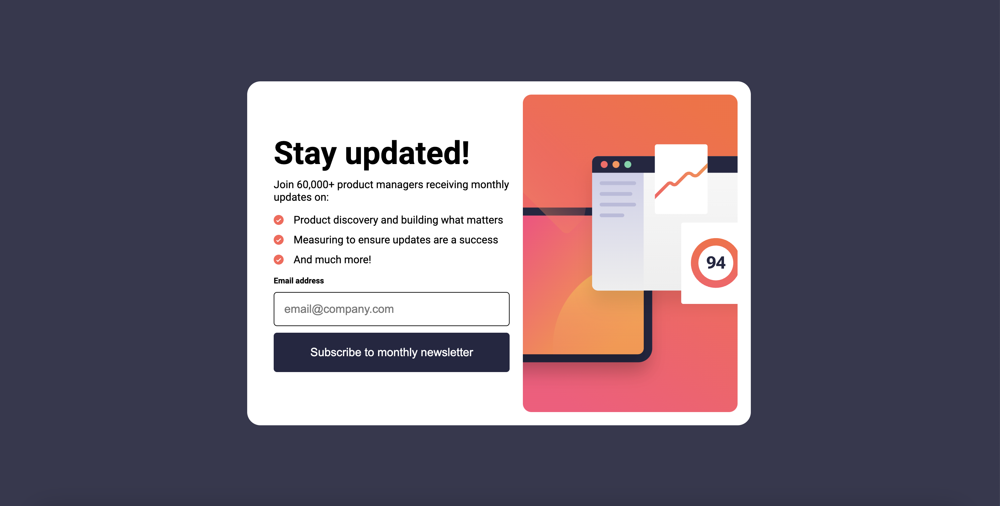
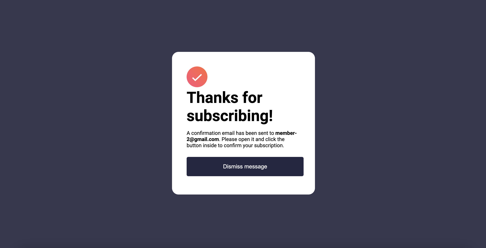
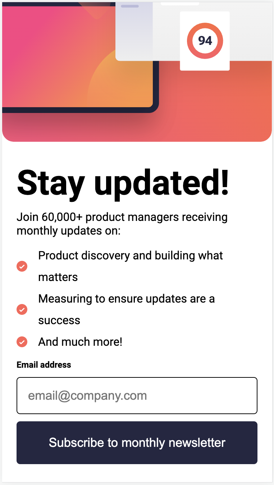
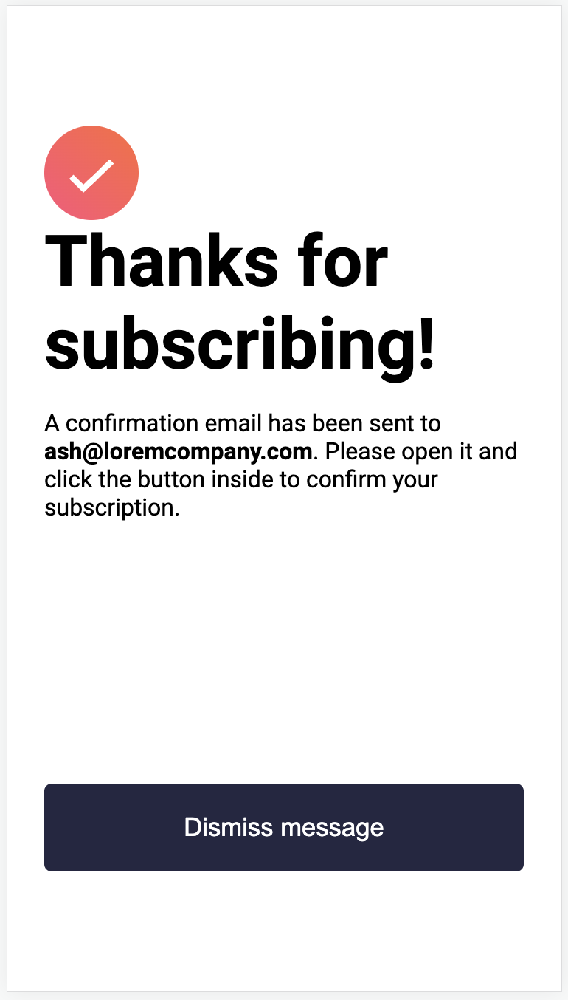

# Frontend Mentor - Newsletter sign-up form with success message solution

This is a solution to the [Newsletter sign-up form with success message challenge on Frontend Mentor](https://www.frontendmentor.io/challenges/newsletter-signup-form-with-success-message-3FC1AZbNrv). Frontend Mentor challenges help you improve your coding skills by building realistic projects. 

## Table of contents

- [Overview](#overview)
  - [The challenge](#the-challenge)
  - [Screenshot](#screenshot)
  - [Links](#links)
- [My process](#my-process)
  - [Built with](#built-with)
  - [What I learned](#what-i-learned)
  - [Continued development](#continued-development)
  - [Useful resources](#useful-resources)

## Overview

My first challenge in Frontend Mentor
### The challenge

Users should be able to:

- Add their email and submit the form
- See a success message with their email after successfully submitting the form
- See form validation messages if:
  - The field is left empty
  - The email address is not formatted correctly
- View the optimal layout for the interface depending on their device's screen size
- See hover and focus states for all interactive elements on the page

### Screenshot

### Links

- Solution URL: [Add solution URL here](https://your-solution-url.com)
- Live Site URL: [Add live site URL here](https://your-live-site-url.com)

## My process

### Built with

- HTML with Semantic HTML5 markup
- CSS with Flexbox

### What I learned

CSS is the most challenging aspect, given that most examples are provided with limited dimensions. It is necessary to imagine different results and list the similarities and differences.

### Continued development

CSS, as a cornerstone of frontend development, presents an ever-evolving landscape of techniques and best practices. Through continued learning and hands-on projects, I aim to stay abreast of the latest advancements in CSS, ensuring that my abilities align with contemporary design standards.

Additionally, delving into theming not only emphasizes the importance of consistent visual branding but also showcases my commitment to creating cohesive and engaging user interfaces. By refining my theming skills, I strive to imbue projects with a unique and polished look, contributing to a seamless and memorable user experience.

As part of my ongoing journey on Frontend Mentor, this emphasis on CSS and theming serves as a catalyst for my growth as a frontend developer. It reflects my proactive approach to addressing challenges and staying attuned to industry trends, ultimately enriching my ability to deliver visually stunning and functionally robust web solutions.

### Useful resources

- [CSS flex](https://css-tricks.com/snippets/css/a-guide-to-flexbox/) - Easy to understand.